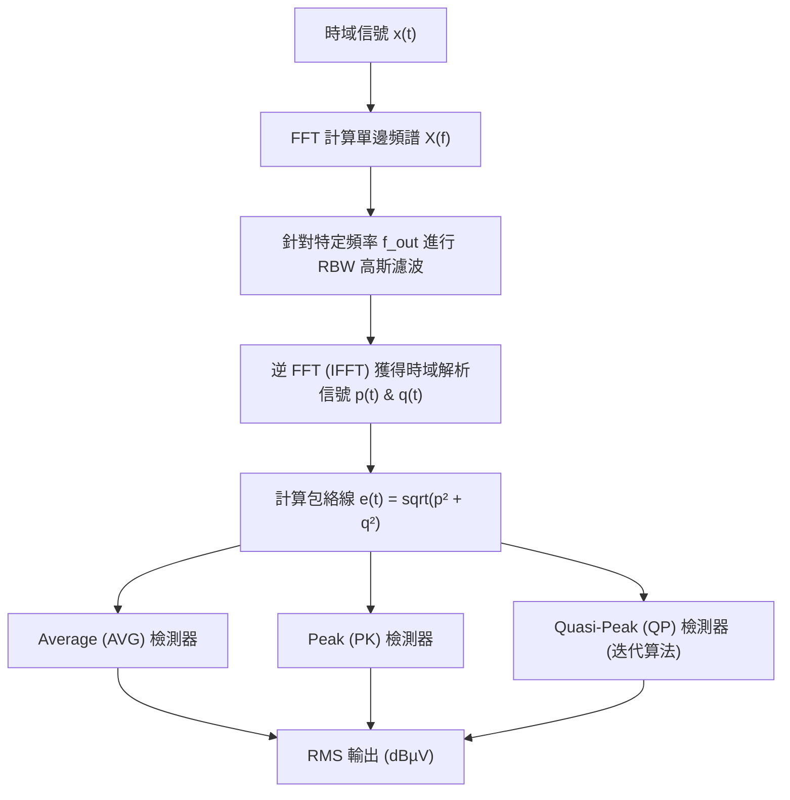

# SSCG 模擬與虛擬 EMI 接收機（Virtual EMI Receiver）量測研究報告

本研究報告基於 `EMI_Study_Report_02.ipynb` 的模擬代碼與分析結果，深入探討了展頻時脈產生器（Spread Spectrum Clock Generator, SSCG）在不同調變參數下，對虛擬 EMI 接收機（Virtual EMI Test Receiver）量測結果（包含 Peak, Average, 與 Quasi-Peak 檢測器）的影響與優化策略。

---

## 1. 理論背景與數學模型

### 1.1 Spread Spectrum Clock Generator (SSCG) 原理
SSCG 透過對時脈信號的瞬時頻率進行動態調變，將集中在單一載波頻率 $f_0$ 及其諧波上的電磁能量分散到較寬的頻帶上，從而降低電磁干擾（EMI）的峰值。
調變訊號的瞬時頻率可表示為：
$$f(t) = f_0 \cdot (1 + \Delta f_{\text{depth}} \cdot v_{\text{mod}}(t))$$
其中：
*   $f_0$：中心頻率 (Central Frequency)
*   $\Delta f_{\text{depth}}$：調變深度 (Modulation Depth)
*   $v_{\text{mod}}(t)$：歸一化的調變波形（如正弦波 Sine、三角波 Triangular 等，振幅介於 $[-1, 1]$）

### 1.2 虛擬 EMI 接收機架構
根據 CISPR 標準，EMI 測試接收機主要包含中頻濾波器（IF Filter）、包絡檢測器（Envelope Detector）及三種檢測器模式（Peak, Average, Quasi-Peak）。本報告採用的虛擬接收機模型如下：

#### 1.2.1 解析度頻寬 (Resolution Bandwidth, RBW) 高斯濾波器
中頻濾波器採用 Revised Gaussian IF Filter，其頻率傳遞函數為：
$$H(f) = e^{-b(f - f_{\text{out}})^2}$$
其中濾波器參數 $b$ 與 $\text{RBW}$ 的關係為：
$$b = \left(\frac{1}{\text{RBW} \times 0.6184}\right)^2$$
當頻率偏離 $f_{\text{out}}$ 時，信號衰減至其 machine precision，從而精確模擬中頻濾波特性。

#### 1.2.2 檢測器數學定義 (RMS 化輸出)
時域包絡線為 $e(t) = \sqrt{p(t)^2 + q(t)^2}$，三種檢測器輸出的 RMS 值定義為：
1.  **Peak (PK) Detector**：
    $$V_{\text{PK}} = \frac{\max(e(t))}{\sqrt{2}}$$
2.  **Average (AVG) Detector**：
    $$V_{\text{AVG}} = \frac{\text{mean}(e(t))}{\sqrt{2}}$$
3.  **Quasi-Peak (QP) Detector**：
    模擬經典的電容充放電電路（充電電阻 $R_c = 1 \text{ k}\Omega$，放電電阻 $R_d = 160 \text{ k}\Omega$），在代碼中採用快速迭代算法求解：
    $$V_{\text{QP}}^{(new)} = \frac{\sum_{e(t) > V_{\text{QP}}} e(t)}{Q + \frac{R_c \cdot N}{R_d}}$$
    其中 $Q$ 為包絡線大於目前估計值的樣本數，$N$ 為總樣本數。最終輸出亦歸一化為 RMS 值：
    $$V_{\text{QP, RMS}} = \frac{V_{\text{QP}}}{\sqrt{2}}$$

---

## 2. 模擬測試規格 (CISPR Bands)

根據代碼定義，測試主要針對以下頻段（Bands）進行模擬：

| 測試頻段 (Band) | 頻率範圍 | 解析度頻寬 (RBW) | 頻率步進 (Frequency Step) |
| :--- | :--- | :--- | :--- |
| **Band A** | $9 \text{ kHz} \sim 150 \text{ kHz}$ | $200 \text{ Hz}$ | $100 \text{ Hz}$ |
| **Band B** | $150 \text{ kHz} \sim 30 \text{ MHz}$ | $9 \text{ kHz}$ | $4.5 \text{ kHz}$ |
| **Band C** | $30 \text{ MHz} \sim 100 \text{ MHz}$ | $120 \text{ kHz}$ | $60 \text{ kHz}$ |

*註：頻率步進均小於二分之一的 RBW，以確保不會漏失頻譜分量。*

---

## 3. 核心模擬實驗與結果分析

本部分探討中心頻率 $f_0 = 1.5 \text{ MHz}$（位於 Band B），調變深度為 $\Delta f = \pm 200 \text{ kHz}$ 的 PWM 信號在不同調變頻率 $f_m$ 下的表現。

### 3.1 實驗一：無展頻（Fixed Frequency）基準對照
*   **參數設定**：固定頻率 $f_0 = 1.5 \text{ MHz}$，無頻率調變。
*   **量測現象**：
    *   在 $1.5 \text{ MHz}$ 處，FFT、PK、AVG 與 QP 的測量數值幾乎重合，均呈現極高且窄的單一尖峰。
    *   由於能量完全集中在載波及其奇數次諧波上，沒有任何展頻效果，EMI 峰值達到最大值。

### 3.2 實驗二：低頻三角波調變 FSS1 ($f_m = 100 \text{ Hz}$)
*   **參數設定**：調變頻率 $f_m = 100 \text{ Hz}$，小於 Band B 的 $\text{RBW} = 9 \text{ kHz}$ ($f_m \ll \text{RBW}$)。
*   **物理機制解析**：
    1.  **慢速掃頻 (Slow Sweeping)**：調變週期為 $10 \text{ ms}$。對於 $\text{RBW} = 9 \text{ kHz}$ 而言，中頻濾波器在極短的觀測時間內，只會看到一個窄帶的瞬時頻率通過。
    2.  **PK 響應**：由於 PK 檢測器捕捉的是最大值，當調變的瞬時頻率掃過中頻濾波器中心時，PK 會記錄下該瞬間的最大能量。因此，**PK 值依然維持在非常高的水準**，幾乎沒有因為展頻而獲得衰減。
    3.  **AVG 響應**：AVG 檢測器對時域包絡進行平均。在 $10 \text{ ms}$ 的調變週期中，瞬時頻率只有極少部分時間落在特定的 $9 \text{ kHz}$ 濾波帶內。因此，該頻帶內的能量在時間上被大幅稀釋，**AVG 值出現顯著的衰減（通常可達 10 dB 以上）**。
    4.  **QP 響應**：QP 檢測器的充電時間極快（$R_c$ 小），放電時間極慢（$R_d$ 大）。當瞬時頻率掃過時，電容迅速充電至接近峰值；而在瞬時頻率偏離該頻帶時，電容緩慢放電。由於放電常數遠大於掃過週期，**QP 值會被維持在接近 PK 的高位**。

### 3.3 實驗三：高頻三角波調變 FSS2 ($f_m = 120 \text{ kHz}$)
*   **參數設定**：調變頻率 $f_m = 120 \text{ kHz}$，大於 Band B 的 $\text{RBW} = 9 \text{ kHz}$，但與 Band C 的 $\text{RBW} = 120 \text{ kHz}$ 相當。
*   **物理機制解析**：
    1.  **快速掃頻 (Fast Sweeping)**：調變週期極短（約 $8.33 \text{ \mu s}$）。此時中頻濾波器的響應時間跟不上瞬時頻率的快速變動。
    2.  **頻譜側帶 (Sidebands)**：高頻調變會使信號在頻域上分裂成一系列相隔 $f_m = 120 \text{ kHz}$ 的離散側帶。
    3.  **能量分散效果**：由於側帶間距（$120 \text{ kHz}$）遠大於 Band B 的 $\text{RBW}$（$9 \text{ kHz}$），濾波器每次只能接收到單個側帶的能量。因為總能量被分攤到了多個側帶上，**PK、AVG 與 QP 值在此時均獲得了實質性的降低**。
    4.  **注意點**：若在 Band C（$\text{RBW} = 120 \text{ kHz}$）中，由於 $\text{RBW}$ 與調變間距相當，濾波器會同時接收到多個側帶，導致展頻的抑制效果在寬頻帶量測下會有所折損。

---

## 4. 進階 SSCG 調變方案評估

為了克服單一調變頻率在不同 RBW 下的限制，模擬代碼實現了幾種工業界（如 TI、MPS）常用的進階展頻方案。

### 4.1 MPS 雙重調變方案 (Dual-Modulation FSS)
此方案結合了低頻三角波（$100 \text{ Hz}$，優化 AVG）與高頻三角波（$120 \text{ kHz}$，優化 PK/QP）。
其瞬時頻率調變波形為兩者的加權組合：
$$v_{\text{mod}}(t) = w_1 \cdot \text{Tri}_{100\text{Hz}}(t) + w_2 \cdot \text{Tri}_{120\text{kHz}}(t)$$

代碼中測試了兩種權重：
1.  **DMFSS1 ($w_1 = 0.75, w_2 = 0.25$)**：偏向低頻調變。
2.  **DMFSS2 ($w_1 = 0.5, w_2 = 0.5$)**：高低頻調變均等。

*   **評估結果**：
    *   雙重調變方案在 Band B（$\text{RBW}=9\text{ kHz}$）中，利用高頻分量將能量打散成離散側帶以降低 PK，同時利用低頻分量使頻譜在時間上擺動以降低 AVG 與 QP。
    *   **DMFSS2** 相比於單純的低頻調變，其 **QP 與 PK 的峰值有更顯著的下降**，能同時滿足 CISPR 標準中對 PK 與 QP 限制值的嚴格要求。

### 4.2 TI 雙隨機展頻方案 (Dual Random Spread Spectrum, DRSS)
DRSS 在三角波調變的基礎上，額外引入了隨機頻率抖動（Jitter）。
$$f(t) = f_{\text{Tri}}(t) + f_{\text{rand}}(t)$$
其中 $f_{\text{rand}}(t)$ 為離散隨機值（如 $\pm 100 \text{ kHz}$ 範圍內的抖動）。

*   **評估結果**：
    *   單純的三角波調變會在頻譜上留下明顯的離散譜線（Discrete Sidebands）。
    *   DRSS 通過隨機抖動，成功將這些離散的側帶譜線「平滑化」（Smoothing），轉化為連續的噪聲底（Continuous Noise Floor）。
    *   這使得 **PK 和 QP 測量值在線性頻譜上更為平坦，消除了局部的電磁輻射尖峰**。

### 4.3 純隨機展頻 (Pure Random Spread Spectrum, RAND)
每個時脈週期的頻率完全隨機選擇，無規律的週期性調變軌跡。
*   **評估結果**：
    *   頻譜完全轉化為寬帶噪聲。
    *   在窄帶量測（如 Band A/B）下，由於頻率跳變是完全隨機且不連續的，能量在時間和頻域上高度分散，能獲得極佳的 AVG 衰減。
    *   然而，若跳變頻率的覆蓋時間不均勻，局部頻率仍可能產生短暫的能量聚集，對 PK 值降低有限。

### 4.4 隨機漫步三角波調變 (Random Walk Triangular Modulation)
在三角波的每個週期結束時，加入隨機的相位或頻率偏移（Random Walk）。
*   **評估結果**：
    *   該波形保留了三角波的大範圍擺動特徵（確保 AVG 衰減），同時藉由隨機漫步消除了週期性，打破了頻域的相干性。
    *   這能有效降低離散諧波的強度，是一種在實際硬體（如開關電源 IC）中非常具有應用前景的展頻技術。

---

## 5. 工程設計指南與總結

根據虛擬 EMI 接收機的模擬研究，在硬體設計中實施 SSCG 時，應遵循以下原則：

1.  **針對特定規程進行設計**：
    *   如果目標是通過 **AVG 限制值**：應優先選擇**低頻調變**（如 $100 \text{ Hz} \sim 9 \text{ kHz}$），讓信號快速擺動出中頻濾波器的頻帶，以獲得最大的時間平均衰減。
    *   如果目標是通過 **PK / QP 限制值**：調變頻率 $f_m$ 必須**大於中頻濾波器的 RBW**（例如在 Band B 中，應選擇 $f_m > 9 \text{ kHz}$，如 $30 \text{ kHz} \sim 120 \text{ kHz}$）。否則，QP 檢測器的充放電特性會使其數值居高不下。

2.  **採用混合/隨機調變技術**：
    *   **雙重調變 (DMFSS)** 能夠在兼顧窄 RBW（優化 PK）與寬 RBW（優化 AVG）的同時，實現均衡的 EMI 抑制。
    *   引入**隨機抖動 (DRSS) 或隨機漫步**可以消除離散的諧波側帶，避免特定頻率點的電磁輻射超標，使系統更容易通過嚴格的 EMI 合規測試。
