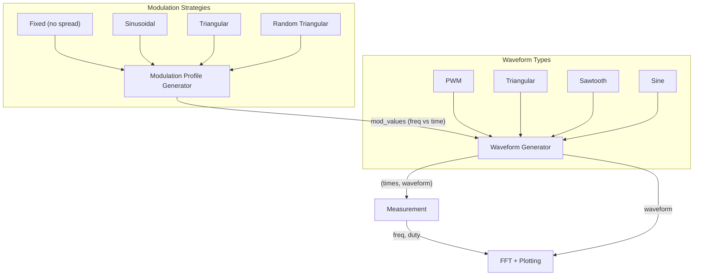

# EMI Study Report Notebook — Detailed Analysis & Improvement Proposals

## What the Notebook Does

This notebook is a **Spread Spectrum Clock Generation (SSCG) simulator and analyzer**. It models how modulating the frequency of a clock signal (e.g., a switching power converter's PWM, or a digital clock) can spread the energy across a wider bandwidth in the frequency domain, thereby **reducing peak EMI emissions**.

This is a core technique used in power electronics, digital clock design, and EMC engineering to pass regulatory limits without expensive shielding.

---

## Architecture Overview

---

## Functions Explained

### 1. `measure_pwm_freq_duty(signal, time)`
Measures the instantaneous **frequency** and **duty cycle** of a PWM (square wave) signal by:
- Finding **rising edges** (`np.diff(signal) == 1`) and **falling edges** (`np.diff(signal) == -1`)
- Computing **period** = time between consecutive rising edges → frequency = 1/period
- Computing **duty** = pulse width (rising→falling) / period

### 2. `detect_peaks(signal, time, threshold)`
A simple **peak detector** for continuous waveforms (triangle/sawtooth):
- Finds local maxima via derivative sign changes
- Applies a **minimum time threshold** between peaks to filter noise/glitches

### 3. `measure_tri_freq_duty(signal, time, threshold)`
Measures frequency and duty for **triangular/sawtooth** waveforms:
- Uses `detect_peaks()` to find cycle boundaries
- Between peaks: measures the fraction of time the derivative is positive → this is the "duty cycle" (the rising-vs-falling time ratio)

### 4. `generate_waveform_cycle(waveform_type, samples, duty)`
Generates a **single normalized cycle** of one of four waveform types:
| Type | Formula |
|---|---|
| **PWM** | High for `duty * samples`, then low |
| **Triangular** | `2 * abs(2*(t-0.5)) - 1` (symmetric triangle) |
| **Sawtooth** | `2 * (t - floor(0.5 + t))` |
| **Sine** | `sin(2πt)` |

### 5. `modulation_function(t, f0, mod_depth, f_mod, modulation_type)`
Generates the **frequency modulation profile** — a time-varying frequency that the waveform generator follows:
| Type | Result |
|---|---|
| `'fix'` | Constant `f0` (no modulation — baseline for comparison) |
| `'sin'` | `f0 * (1 + mod_depth * sin(2π * f_mod * t))` |
| `'tri'` | `f0 * (1 + mod_depth * sawtooth(2π * f_mod * t, width=0.5))` |

This is where the **spread spectrum** magic happens — the clock frequency is swept up and down according to this profile.

### 6. `generate_modulated_waveform(waveform_type, fs, duration, mod_values, f_rand, duty)`
The core engine that stitches waveform cycles together:
1. Looks up the **current target frequency** from `mod_values`
2. Optionally adds **random frequency jitter** from `f_rand`
3. Generates one cycle at that frequency using `generate_waveform_cycle()`
4. Appends to the output and advances time by one period
5. Repeats until `duration` is reached

> [!IMPORTANT]
> The frequency is updated **once per cycle boundary**, not sample-by-sample — this is physically realistic, modeling how real SSCG hardware works.

### 7. `mod_rand_tri(f0, mod_depth, fm_rand, fs, T_sim)`
Generates a **random triangular modulation** profile:
- The modulation (**triangle wave at varying frequencies** randomly selected from `fm_rand` list) controls how fast the frequency sweeps
- Result: a spread spectrum profile where the sweep rate itself is randomized — further flattening the EMI spectrum

### 8. `prepare_waveform(...)`
**Master orchestrator** that:
1. Generates the time vector
2. Computes the modulation profile (or accepts a custom one)
3. Calls `generate_modulated_waveform()` to build the time-domain signal
4. Measures instantaneous frequency and duty cycle
5. Computes the **FFT** (DC removed, sorted, in dB)
6. Packs everything into a dictionary for plotting

### 9. `plot_waveform(data, fig, axs)`
Plots 4 subplots for each waveform configuration:
1. **Time-domain waveform** (zoomed to ~12 cycles)
2. **Instantaneous frequency vs. time** — measured dots vs. ideal modulation curve
3. **Duty cycle vs. time**
4. **FFT magnitude (dB) vs. frequency** — the key EMI analysis plot

---

## The Demo Section

The demo creates **4 waveform configurations** and overlays them on the same figure to compare EMI reduction strategies:

| Label | Waveform | Modulation | Random Jitter | Color |
|---|---|---|---|---|
| `w1` | **PWM** | Fixed (500 kHz) | ±5 kHz random | Blue |
| `w2` | **Triangular** | Triangular (10 kHz sweep) | None | Red |
| `w3` | **PWM** | Sinusoidal (10 kHz sweep) | None | Green |
| `w4` | **PWM** | Random triangular | None | Orange |

### Key Parameters
- `f0 = 500 kHz` — center frequency
- `D = 0.5` — 50% duty cycle
- `mod_depth = 0.1` — ±10% frequency spread
- `fs = 200 MHz` — sampling rate
- `T_sim = 1 ms` — simulation duration
- `f_mod = 10 kHz` — modulation frequency

### What the Results Show
The **FFT subplot** is the most important one — it shows how different modulation strategies redistribute the spectral energy:
- **Fixed frequency (w1 blue)**: Sharp spectral peaks at harmonics → high EMI
- **Triangular modulation (w2 red)**: Energy spread with characteristic shape
- **Sinusoidal modulation (w3 green)**: Different spreading profile (more energy at edges)
- **Random triangular (w4 orange)**: Most uniform spreading → best EMI reduction

---

## Proposals for Improved Readability & Educational Value

### 1. Add Markdown Cells with Theory

The notebook jumps straight into code without explaining the **why**. Add markdown sections covering:
- What is EMI and why it matters
- What is Spread Spectrum Clock Generation (SSCG)
- How frequency modulation reduces peak harmonic energy
- Visual diagrams showing before/after in the frequency domain

### 2. Break the Monolithic Code Cell into Logical Sections

Currently, **all functions are in a single massive code cell**. Each function should be in its own cell, preceded by a markdown explanation:
- **Cell 1**: Theory — Waveform Generation
- **Cell 2**: `generate_waveform_cycle()` with inline examples
- **Cell 3**: Theory — Frequency Modulation Profiles
- **Cell 4**: `modulation_function()` with a standalone plot showing each profile
- **Cell 5**: Theory — Cycle-by-Cycle Waveform Construction
- **Cell 6**: `generate_modulated_waveform()` with a simple demo
- etc.

### 3. Add Interactive Visualizations

Use `ipywidgets` sliders to let users **interactively adjust**:
- `f0`, `mod_depth`, `f_mod`
- Waveform type and modulation type
- See the FFT update in real-time

This would make the notebook far more educational.

### 4. Improve Code Quality

| Issue | Suggestion |
|---|---|
| Global variable `f0` referenced inside `generate_modulated_waveform` (line: `if f_current == 0: f_current = f0`) | Pass `f0` as a parameter |
| `plot_waveform` references global `f0` and `waveform_type` | Pass these as parameters or extract from `data` dict |
| Unused `import time` | Remove it |
| Inconsistent use of `signal` as both a parameter name and `scipy.signal` module | Rename the parameter to `sig` or `waveform` |
| Magic numbers in plot limits (`12/f0`, `300/f0`, etc.) | Make these configurable or compute from data |
| No type hints or docstrings on several functions | Add comprehensive docstrings |

### 5. Add Quantitative EMI Comparison

After the plots, add a cell that **numerically compares** the peak harmonic levels:
- Table showing peak dB at f0, 2×f0, 3×f0 for each configuration
- Compute the **peak reduction in dB** vs. the fixed-frequency baseline
- This gives concrete numbers for the EMI benefit of each spreading strategy

### 6. Add a "Conclusion" Markdown Cell

Summarize the key findings:
- Which modulation strategy gives the best peak reduction?
- What are the trade-offs (e.g., triangular vs. sinusoidal vs. random)?
- Practical implications for hardware design

---

## Summary

The notebook is a well-structured simulation of **SSCG techniques for EMI reduction**, comparing fixed-frequency, sinusoidal, triangular, and random-triangular frequency modulation profiles applied to PWM and triangular clock waveforms. The FFT analysis shows how each strategy spreads the spectral energy.

The main areas for improvement are:
1. **Add explanatory markdown** between code cells
2. **Split the monolithic code cell** into individual, documented functions
3. **Fix global variable references** and code quality issues
4. **Add quantitative comparison** tables
5. **Add interactive widgets** for hands-on exploration
6. **Add theory and conclusion** sections
